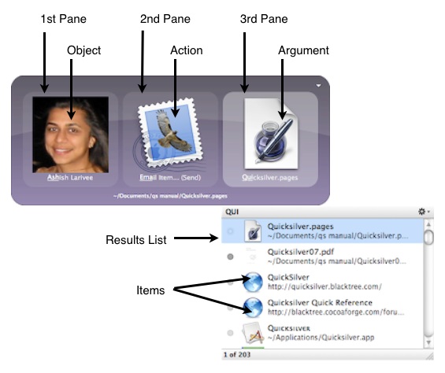

# Why Quicksilver

While Quicksilver is easy to use and very powerful, it's not obvious how to use it and it takes a little while to realize its power. As a result it's difficult to explain why Quicksilver is so great.

It took me about a week before I really "got" Quicksilver, and I think that's pretty common. And then it took months of writing the manual to understand all the nooks and crannies. You can start off small and add to your knowledge slowly. The real power (and difference from Spotlight) is that there are multiple actions you can choose from, not just "open".

The part that's hard to describe is this.  On a Mac today you do a lot of different things and go to different programs to do them (e.g., Safari for browsing, Mail for email, Messages for IM, Contacts for contacts, etc.) Even though the Mac is pretty consistent, these are all different applications and depending on what you want to do, you do different things, click in different places, use different shortcuts, etc.

Now imagine using Spotlight a lot. You would activate Spotlight, type the name of the thing you wanted to work with and hit return to open it in its app.  Maybe it's a bookmark that opens in Safari or a contact that opens in Contacts or a mail message that opens in Mail or a song that plays in iTunes. Once you do this, you use that app to do stuff.

With Quicksilver you have a consistent interface as with Spotlight but with Quicksilver's actions you can get to the next step and often that's enough for the whole task. I can send a file to someone from Quicksilver alone, it will use Mail and Finder and Contacts to do the work in the background but I just used Quicksilver. I can control iTunes with keystrokes to go to the next song or pause or mute, from Quicksilver without leaving the task I'm working on. I can move or copy files without having to manipulate Finder windows or dragging and dropping.  I can do a Google search (or IMDb or Wikipedia) from within Quicksilver and have the results show in my browser. 

All this (and more) makes Quicksilver a consistent interface for my Mac and that has some psychological effect that makes things seem even easier than Quicksilver is making them. Quicksilver is my Mac to me. and that's hard to describe to someone who hasn't played with it. 

# Installation

## Requirements

* The latest version runs on OS X 10.9+
* Previous versions are available for older versions of OS X, including for PPC hardware.

## Installing Quicksilver

1. [Download Quicksilver](https://qsapp.com/download.php).
2. Open the `.dmg` file and drag Quicksilver to your Applications folder.
3. Drag the Quicksilver volume to the trash and delete the `.dmg` file.

On first launch, Quicksilver presents some setup options (it can be rerun later with the Run Setup button in the Application Preferences). Choose a shortcut that activates the Quicksilver command window, or just accept the default, <kbd>⌃</kbd><kbd>space</kbd>.  Quicksilver scans your computer for applications to recommend plugins to install. If the Contacts plugin is installed, the system will ask if you want to give Quicksilver access to your Contacts, click OK.

Initially, Quicksilver shows no windows when it is running. Activate Quicksilver using the shortcut <kbd>⌃</kbd><kbd>space</kbd> (if you accepted the default).

When Quicksilver starts it contacts qs0.qsapp.com to check for new versions. A security program like Little Snitch that monitors outgoing network connections might warn about this. It’s perfectly normal and benign.

## Support Files

The Quicksilver.app is usually installed in `/Applications/` or `~/Applications/`. Like most OS X applications Quicksilver stores its configuration information in the user's `~/Library` folder. As of 10.8, OS X hides this folder from the Finder by default. The Quicksilver action **Make Visible** from the File Attributes Plugin can be used to let the Finder show it. When first used, the following per user files and folders are created:

- `~/Library/Application Support/Quicksilver/`
    - `Actions.plist` - list of installed actions
    - `Catalog.plist` - the configured catalog sources
    - `Mnemonics.plist` - learned inputs, defaults and abbreviations
    - `PlugIns.plist` - the list of available plugins and how they are configured
    - `Triggers.plist` - the configured triggers
    - `PlugIns/` - installed plugins
    - `Shelves/` - where items on the Shelf and clipboards are stored
    - `Actions/` - add scripts here that implement actions
    - `Templates/` - not installed but create this folder to use with the Make New… action
- `~/Library/Preferences/com.blacktree.Quicksilver.plist` - various preferences and internal state
- `~/Library/Caches/Quicksilver/` - various state including indexes in binary files
- `~/Library/Caches/com.blacktree.Quicksilver/` - various state in binary files

It can also be useful to move or rename these while troubleshooting a problem. If plugins are not installing sometimes the permissions of `~/Library/Application Support/Quicksilver/` and the `PlugIns` folder inside it are wrong. If the owner is System, change it to your user account and restart Quicksilver.

## Uninstalling Quicksilver

Move the application file to the trash. This leaves the configuration files. If you reinstall Quicksilver, your configuration will be restored. To remove all remnants of Quicksilver, use the Uninstall Quicksilver button in the Quicksilver's preferences.

# Working with Quicksilver

When I want to do something on my Mac, my first reaction is to use Quicksilver. Whether I want to send an email, search for something on the web, open a bookmark, file, or an application, revisit a web page I looked at yesterday, pause iTunes, find a song, or virtually anything else, I type <kbd>⌃</kbd><kbd>space</kbd> and activate Quicksilver to do it. That makes Quicksilver very powerful, but also a little difficult to explain. I’ll use an example of sending email to my friend Ashish.

First, I could open Mail, type <kbd>⌘</kbd><kbd>N</kbd> to open a new message, type enough of Ashish to have her address appear in the To: field and then <kbd>tab</kbd> to the Subject and continue writing the message. I could instead open Contacts, search for Ashish’s card, and <kbd>⌃</kbd>-click (or right-click) on the email address and choose Send Email. 

This is how I do it using Quicksilver. I type <kbd>⌃</kbd><kbd>space</kbd><kbd>A</kbd><kbd>Return</kbd>. That’s it. 

Let’s walk through that. <kbd>⌃</kbd><kbd>space</kbd> at any time, in any application, activates Quicksilver bringing up the two pane window shown here. 

When I type <kbd>A</kbd>, Ashish appears in the first pane because I often send her email. Her picture appears because I have her picture in her Contacts entry (mostly because Quicksilver makes such good use of it). Also another window appears with other choices. If I kept typing, those would change to be some other choice, but since Ashish is what I want, I’m done. The second pane shows the **Compose Email** action which is what I want to do. This appears because it’s the most common thing I do with contacts. Typing <kbd>return</kbd> performs the selected action so I see a new Compose Message window appear from Mail.app with Ashish’s address filled in.

Maybe using Quicksilver doesn’t seem that much easier than the other methods described, but the Quicksilver method is done entirely via keystrokes. There’s no mousing to the Dock to open a particular icon or having to select a specific field, just type 3 keystrokes. Maybe the comparison seems unfair because I said some of the choices appeared so easily since I do this often, but that’s one of the advantages of Quicksilver. It learns what you do and makes your most frequent tasks easier. The other methods don’t learn and don’t get any shorter. 

Now let’s say I wanted to send a document to Ashish. Instead of choosing the default **Compose Email** action, I can tab to the second pane, type <kbd>e</kbd><kbd>m</kbd><kbd>a</kbd><kbd>i</kbd><kbd>l</kbd><kbd>i</kbd> to choose **Email item...(Compose)**, this opens a third pane which I tab to and type <kbd>~</kbd><kbd>/</kbd><kbd>Q</kbd> to choose a document in my home directory. Now the message window is opened with the attachment all set up. Say Ashish was expecting this document and I didn’t need to include any text in the message, just the attachment. I could choose the action **Email item...(Send)** and then the message is sent in the background without opening Mail and without disturbing what I was doing before. The subject is set to the name of the attachment and the body includes a short sentence saying the file is attached to the message.

The above works if I’m thinking, “I want to send Ashish this document”. Say instead I thought “I need to send this document to Ashish”. I can do this as well. Select the document in the first pane, choose the **Email to...(Compose)** action and then choose Ashish. I find these options the real strength of Quicksilver. It lets me easily do what I want, however I think of it at the time. I don’t need to change my thinking to how Quicksilver wants me to do things, and it learns from me and gets easier to use over time. The amazing thing about Quicksilver is how flexible it is. Via a wide variety of plugins, Quicksilver can select just about anything on your Mac as an object and do potentially hundreds of different things to it. Of course, it can also do a lot more, get used to reading that.

# Concepts and Terminology

Quicksilver is a modular application. This manual is organized around the things that Quicksilver can manipulate such as files, text, music, etc. Various Quicksilver concepts and facilities are introduced here so that the explanations in each following section can make use of them. A term introduced and defined is written like **_this_**.

These are the modifier key abbreviations used:
- <kbd>⌘</kbd>	Command
- <kbd>⌥</kbd>	Option
- <kbd>⌃</kbd>	Control
- <kbd>⇧</kbd>	Shift

Combinations are achieved by holding down one or more modifier keys and typing another key such as a letter, number or punctuation character. E.g., <kbd>⌘</kbd><kbd>;</kbd>, <kbd>⌥</kbd><kbd>⌘</kbd><kbd>S</kbd>, etc. The arrow keys are shown as: <kbd>→</kbd>, <kbd>←</kbd>, <kbd>↑</kbd>, and <kbd>↓</kbd>.

The Quicksilver application runs in the background. Typically there is no menu, dock icon, menu bar icon or other indication of Quicksilver on screen until it is **_activated_** with the shortcut <kbd>⌃</kbd><kbd>space</kbd>, though there are preferences to change this. Preferences are available by typing <kbd>⌘</kbd><kbd>,</kbd> when Quicksilver is activated (this is the Mac standard shortcut for opening Preferences).

Quicksilver commands are entered via two or three panes containing respectively an **_object_**, an **_action_** and if a third pane is needed, an **_argument_**. These are the terms used in this manual, but unfortunately other terms are used in some places in Quicksilver and in the forums and other articles. The Primer Interface labels the panes Subject, Action, and Object. Some forum posts use Subject, Verb, and Object; and others use Direct Object, Verb, and Indirect Object. Much of the built-in plugin documentation refers to objects in the first and third panes as "items". This manual uses the terms in the diagram above. 

When typing in one of the panes, Quicksilver determines what items **_match_** and puts the top choice in the pane and additional, lower ranked matching items are shown in the **_results list_**. This happens for each pane so the results list will contain objects, actions, or arguments depending on which pane is selected.  The results list above is showing the possible arguments that match the entered text <kbd>Q</kbd><kbd>u</kbd><kbd>i</kbd>. The term **_item_** is used for something appearing in the results list, regardless of whether they are objects, actions or arguments.

**_Plugins_** are optional modules that are installed which can add objects, actions or other capabilities to Quicksilver. Plugins are managed entirely from within Quicksilver Preferences including finding, installing, updating, enabling, configuring and removing them. 

The **_Catalog_** is the list of objects that can be selected in Quicksilver's first pane. Quicksilver populates the catalog by scanning **_catalog sources_** that are configured in the Catalog Preferences. The scanning is done in the background at regular intervals (every 10 minutes by default) so the catalog is kept up-to-date.

For example, there is a source for Safari which indexes bookmarks and history into the catalog. Each bookmark is an object in Quicksilver. So are files and folders in the home directory,  contacts in Contacts, all the apps in the Applications directory, albums in iPhoto, the playlists in iTunes, and many other things (provided the appropriate plugins are installed). Note that some plugins (such as Remember the Milk) allow Quicksilver to index things stored on web servers and not merely things on the hard drive.

A Preference pane shows all the available actions. All actions work on objects and actions are available based on the **_type_** of object selected. E.g., the **Open URL** action is only available for objects that are URLs. Actions that require an argument typically end in “…” and arguments are expected to be of a certain type. E.g., the **Email to…** actions expect the argument to be an email address or contact. Actions with optional arguments usually end in "[…]"

Some actions have a complementary action that reverse the object and argument ordering. Consider the two commands: 

> file, **Email To… (Compose)**, address

> address, **Email Item… (Compose)**, file

Notice the names of the actions are slightly different (**To** vs **Item**). Many (but not all) action names hint at the type of argument they take. **Email To….** wants an address to follow. **Email Item…** wants some kind of item to send (text or a file). These email actions are similarly named and many people don't notice they are two different actions. In other cases actions are so differently named people might not notice they are related. For example, to perform a web search on a site like Google the commands are: 

> site, Search For…, query

> query, Find With…, site

There are also unfortunately some actions like **Make New…** which have no complement and don’t hint at what their argument type is. Explaining these actions is one of the reasons this manual exists.

**_Interfaces_** are configurable themes that change the appearance of the command window. They are installed as plugins and can be configured from the Appearance Preference pane. There are two built-in interfaces, Primer and Bezel. Primer is meant for new users as it labels a few things explicitly. Bezel is what has been shown so far and is used predominantly in this manual.

Objects, actions and arguments are selected by typing. As each letter is typed the choices are filtered down from all possible choices to only those that match the input (and these are shown in the results list). The matching method is one of the strengths of Quicksilver. Matches can be by the beginning of the phrase (e.g.,  <kbd>D</kbd><kbd>e</kbd><kbd>s</kbd><kbd>k</kbd> for “Desktop”) or by initials (e.g., <kbd>B</kbd><kbd>A</kbd> for “Browse Artists” which is an iTunes object). The more items (objects and actions) are used, the more quickly they will be matched. After typing <kbd>D</kbd><kbd>e</kbd><kbd>s</kbd> a few times Quicksilver will start guessing “Desktop” and if done often enough, it will start matching after just <kbd>D</kbd>. 

Some items have **_Children_**, e.g., folders have files, contacts have phone numbers and addresses, musical artists have albums, etc. When an item has children there is a > on the right side of the item in the results list. View the children (e.g., go into a folder) by typing <kbd>→</kbd> or <kbd>/</kbd>. The object then changes to the top child and the results list shows the other children. Navigate these by using the <kbd>↑</kbd> and <kbd>↓</kbd> arrows or better yet by typing to match against this list. This is an easy way to navigate folder hierarchies, or any other hierarchies.

Quicksilver's matching algorithm makes finding something specific very efficient and Quicksilver's ability to perform many different actions on objects makes it powerful. The command window is efficient but there are even faster ways to perform commands. **_Triggers_** can be configured to start or complete a frequently used command. Typically keyboard triggers are used to run a command when a global shortcut key is pressed, but there are other triggers that run on mouse events such as clicks, drags or moving into a corner of the screen. Triggers can be invoked at anytime, without having to first activate Quicksilver (with <kbd>⌃</kbd><kbd>space</kbd>). There are built-in triggers to control iTunes (pause, play, skip to the next song or rate the current song) but it's easy to configure them to open a particular application or prompt for a query to send to Google.

**_Proxy objects_** work especially well with triggers. These are special objects which represent something on the system such as the currently selected text (which may be sent to a search engine) or the last downloaded file (which may be opened or moved) or the URL of the current page in Safari (which may be pasted into a document). 

**_Collections_** are groups of objects or arguments built up by using [the comma trick](/quicksilver/Quicksilver/wiki/Invoking-Quicksilver#the-comma-trick).

# Invoking Quicksilver

## Activating Quicksilver

OS X uses the term activate to mean switching to an application (starting it if necessary).  In fact there's a Quicksilver action called Activate that does just that. The menu bar show the menus of the active application. But Quicksilver runs in the background and unless it's Preferences are open, it's not the active application (it's menu isn't in the menu bar). Activating Quicksilver, that is making it ready to use, is typically done by using the keyboard shortcut (by default <kbd>⌃</kbd><kbd>space</kbd>) to bring up the command window. The first pane is selected and ready to find something in the Catalog via typing.

## Selecting Items

With Quicksilver activated and the first pane selected, type some characters and an object will appear. To bring up a Contacts entry for Abraham Lincoln (doesn't everyone have him in their Address Book?), type <kbd>a</kbd><kbd>b</kbd><kbd>r</kbd><kbd>a</kbd><kbd>h</kbd><kbd>a</kbd><kbd>m</kbd>, <kbd>a</kbd><kbd>b</kbd><kbd>r</kbd><kbd>a</kbd><kbd>h</kbd>, <kbd>a</kbd><kbd>b</kbd>, or maybe just <kbd>a</kbd><kbd>l</kbd> to select it. The trick is to keep typing the name of item until it appears in the first pane (and at the top of the results list).

If it doesn't quite make to the top of the results list, scroll through the list and find the item and click it to select it. This can happen if there are several objects with the same name, for example a Contacts entry for Abraham Lincoln and a Finder folder named the same thing.

Quicksilver remembers what's been typed and what's been selected and learns to guess better as its used. If I type <kbd>a</kbd> and pick Abraham Lincoln's Contacts entry, Quicksilver will start to guess it more often instead of the folder of the same name or "AirPort Utility" or "Adium" or other things that begin with "a".

The matching algorithm that Quicksilver uses for selecting objects (it's not used for selecting actions) and how you can help it learn more efficiently are discussed below. 

Quicksilver includes a lot of things in its Catalog but to keep things fast it doesn't include everything on the system and unlike Spotlight it doesn't index the contents of objects, just their names. Lincoln's Contact entry may have his phone number and email address, but typing them in the first pane won't match the Contact. Quicksilver can navigate an iTunes music collection, but doesn't include all songs and artists in the Catalog. 

That’s not to say Quicksilver can’t use and manipulate these things. Once a parent object (in these example a contact or the iTunes apps) is selected, typing <kbd>→</kbd> will move into the object and the results list will show its children (the contact fields or music collection). The results list displays items with children by showing a > at the far right. Navigating like this is often referred to as "right-arrowing into an object". Similarly <kbd>←</kbd> will select the parent object. Quicksilver can navigate files and folders this way too. So while every file might not be indexed in the Catalog, the entire filesystem can be navigated using the arrow keys in Quicksilver. Since this is so common, the <kbd>/</kbd> key is a synonym for <kbd>→</kbd> and <kbd>⇧</kbd><kbd>/</kbd> (which is <kbd>?</kbd> on American keyboards) can be used for <kbd>←</kbd>.

A mouse or trackpad can be used to navigate the results list, but Quicksilver can do virtually anything from the keyboard. The <kbd>↓</kbd> and <kbd>↑</kbd> keys will move the selection in the results list down and up one item. For touch typists, the keystrokes <kbd>⌃</kbd><kbd>N</kbd> (next) and <kbd>⌃</kbd><kbd>P</kbd> (previous) will do the same thing and <kbd>⌃</kbd><kbd>V</kbd> and <kbd>⌥</kbd><kbd>V</kbd> will scroll the results list down or up one whole screen.

For Vim users, <kbd>⌃</kbd><kbd>H</kbd>, <kbd>⌃</kbd><kbd>J</kbd>, <kbd>⌃</kbd><kbd>K</kbd>, and <kbd>⌃</kbd><kbd>L</kbd> can also be used in place of the arrow keys.

By default Quicksilver shows the results list after a short delay. This behavior can be changed to Immediately or Never in the Command Preferences under “Show other matches”. There is also a choice to configure the spacebar to behave like <kbd>↑</kbd> or <kbd>→</kbd>.

## Dealing with Typos

There are some subtle differences that are harder to explain than to use, but if you make a typo while searching there's no way to delete just a letter or two. The delete key <kbd>⌫</kbd> clears the whole search leaving Quicksilver at the current level and the escape key <kbd>⎋</kbd> will clear the whole search resetting Quicksilver back to the top level of navigation. The keys <kbd>⌃</kbd><kbd>U</kbd> and <kbd>⌘</kbd><kbd>X</kbd> will reset the search entirely, moving back to the top level. If a Quicksilver pane is in text mode these behave slightly differently, as shown below.

| Key | Regular Mode | Text Mode |
| --- | ------------ | --------- |
| <kbd>⌫</kbd> | clears search, leaves object, leaves results list, same level | deletes one character |
| <kbd>⌫</kbd><kbd>⌫</kbd> | same as <kbd>⌫</kbd> | deletes two characters |
| <kbd>⎋</kbd> | stops search, leaves object, closes results list, back to top | leaves text mode |
| <kbd>⎋</kbd><kbd>⎋</kbd>  | closes window, back to top | closes window |
| <kbd>⌃</kbd><kbd>U</kbd> | empty’s window, dismisses results list, back to top | nothing |
| <kbd>⌘</kbd><kbd>X</kbd> | empty’s window, dismisses results list, back to top | deletes selection |

The Command Preferences has an option, “Reset search after” time. This is how long between keystrokes Quicksilver waits before reseting the search. So if it’s set to .85 seconds and it’s been 1 second since a key has been typed, typing another one will start the search in the same level of navigation.

## TODO: Combining Activation and Selection

There are faster ways to use Quicksilver too. You can activate it and put something in one or more panes at the same time. Triggers let you define key sequences, mouse clicks, and mouse gestures that will activate Quicksilver and fill in some panes and even execute commands immediately. These are discussed in more detail below but it’s worth describing two triggers now. 

In the Triggers Preferences under Quicksilver are two predefined triggers: **Command Window with Selection** and **Command Window in Text Mode**. The first opens a command window with the current application’s selection in the first pane. This is typically text, though for the Finder this is one or more selected files or folders. Some other applications like iPhoto and iTunes also allow their non-text selection to be brought into Quicksilver. The second trigger will bring the selection into the first pane but will put that pane into text-mode so you can edit it.

Quicksilver installs two services available in other applications (look in the application’s menu under Services and you’ll see Quicksilver). The two services are **Get Current Selection (Internal)** and **Send to Quicksilver**. The fact that there are two of them is a quirk of the implementation, you can use either, but **Send to Quicksilver** is the one meant to be used from the menu. It activates Quicksilver and puts the application’s current selection (typically text) into the first pane. The other service is the internal mechanism that enables <kbd>⌘</kbd><kbd>⎋</kbd>  and the Current Selection proxy object (used in triggers). These basically accomplish the same thing as **Send to Quicksilver**. Apple’s Front Row also uses <kbd>⌘</kbd><kbd>⎋</kbd> by default and this conflicts with the Quicksilver service. You can change the Quicksilver key binding in Quicksilver’s Preferences, under Command, using the Alternate Services Menu Key setting. Or if you prefer, the Front Row shortcut can be changed in the Keyboard & Mouse system preferences in the Keyboard Shortcuts tab. Even if you uncheck it, Front Row still works with the Apple Remote. I have the **Command Window with Selection** trigger mentioned above assigned to <kbd>⌘</kbd><kbd>⎋</kbd>. TODO: If <kbd>⌘</kbd><kbd>⎋</kbd> isn’t working for you, check in the Catalog under Quicksilver that Internal Commands is enabled.

Yet another way to put the selection into the object pane is to activate Quicksilver and then type <kbd>⌘</kbd><kbd>G</kbd>. This is slower than the other methods since you have to activate Quicksilver first, but since I learned it first, it’s in my fingers, so I use it a lot. By default <kbd>⌘</kbd><kbd>G</kbd> only puts the Finder’s selection into the first pane. TODO: in the Extras Preferences checking “Pull selection from front application instead of Finder” will make <kbd>⌘</kbd><kbd>G</kbd> behave just like <kbd>⌘</kbd><kbd>⎋</kbd>, using the same mechanism.

If Quicksilver is already running, clicking on the Quicksilver.app icon will bring up the command window. If you drag and drop something onto the icon it will be selected in the first pane. This is convenient if Quicksilver is in your Dock, but people also put it in the Finder’s sidebar or toolbar. This is particularly useful if you hide your Dock and use Finder windows often (I find the more I use Quicksilver, the less I use the Finder).

There are other, less obvious ways to select something in a Quicksilver command window pane. As discussed above you can type <kbd>⌘</kbd><kbd>G</kbd> to choose the Finder’s selection (or possibly the selection of the frontmost application). You can also paste something into the pane with the standard key binding <kbd>⌘</kbd><kbd>V</kbd> and you can drag and drop something into a pane as well (you need to start the drag before invoking Quicksilver). 

You can select the last object used by typing <kbd>⌘</kbd><kbd>[</kbd> after activating Quicksilver. In fact it recalls the entire last command, that is the object, action and argument used. Unfortunately as of B51 it toggles between the last command and the current one and you can’t select earlier ones by typing <kbd>⌘</kbd><kbd>[</kbd> again.

## TODO: Immediate Execution

You can create triggers that perform an entire command, like open an application or anything else. Triggers are great but they require you to pre-configure them. You can also perform a command by holding down the key you use to select a subject or action. For example, if you type ad to select Adium.app and hold down the <kbd>D</kbd> then Quicksilver will execute the default action which should be **Open**. As described above, for me typing a will default to the Contacts contact for my friend Ashish.  I can activate Quicksilver and hold down <kbd>A</kbd> to open an email message (the default action for a contact) addressed to her. 

This trick also works for actions.  If you hold down the last key you type to select an action it will execute it. So I can select Ashish in the first pane, tab to the second and hold down <kbd>E</kbd> to use the **Edit Contact** action. This method is a little risky if you don’t know what the action will be, but if you do it’s a little faster and there’s no trigger configuration needed. It’s less risky when you realize you can configure the ranking of actions in the Actions preference pane.

To make it faster you can type the letter with the <kbd>⇧</kbd><kbd>⌘</kbd> modifiers from the first pane. So to edit Ashish’s contact entry I would activate Quicksilver, type a to bring up her entry and then type <kbd>⇧</kbd><kbd>⌘</kbd><kbd>E</kbd> to have Quicksilver execute the command. This only allows you to use one letter to identify the action and has the same risk that you have to know what action will be run, but if you do, it can be convenient.

TODO: holding down <kbd>tab</kbd> in first pane will execute the command. Holding down <kbd>→</kbd> or <kbd>/</kbd> when navigating will too.

## The Comma Trick

A non-obvious feature is known as the **_comma trick_**. The <kbd>,</kbd> key allows multiple items to be selected in first or third pane and then a single action can operate on all of them with one command. This can move several files to the same place or address an email to multiple people.

Activate Quicksilver, select an item, type <kbd>,</kbd> and then select another item. A collection of smaller icons accumulate at the bottom or left of the object pane depending on the interface used (the menu interface does not support the comma trick). Any number of items can be selected, after which <kbd>tab</kbd> to the action pane and continue as normal.

Another way to select multiple items is with <kbd>⌘</kbd><kbd>A</kbd>. It will select all the items in the results list as if the comma trick had been used individually for all of them. If the results list is long this can take a long time. It’s most useful to operate on all the items in a small folder (e.g., deleting, moving, or tagging them all).

Collections can be browsed using <kbd>⌃</kbd><kbd>[</kbd> and <kbd>⌃</kbd><kbd>]</kbd>. The currently selected object can be removed from the collection with the <kbd>⌫</kbd> key.

## Filtering the Results List

The default behavior of Quicksilver is to **_filter_** the results list when searching. As keys are entered, things that don't match are removed from the results and the remaining items are sorted based on who well they match what was entered.

There's an often overlooked gear menu at the top right of the results list. It can change the search mode of the results list. Instead of filtering the results list can be set to snap to a match. The items remain sorted and as keys are typed the selected item is changed (and the list scrolled) but non-matching items aren't removed from the list. 

Sometimes these behaviors are known as **_narrowing_** (filtering) and **_selection_** (snapping).

TODO: (is this right?)

- **_Filter Results_** - Filters the current results list.
- **_Filter Catalog_** - Filters, but also includes the entire contents of the top-level catalog. Lasts until you type esc or activate Quicksilver again (<kbd>⌃</kbd><kbd>space</kbd>).
- **_Snap to Best_** - scrolls the results list to the best match but doesn’t remove non-matching items.

## TODO: Helping the Matching Algorithm

Quicksilver learns what you do (and makes that easier to do) because of its matching algorithm. It remembers what commands you execute and what you did to call them up, do them a few times and they get easier to call up. However if you do things that are similarly named it confuses Quicksilver and it won’t guess as quickly as it could. Fortunately you can teach it. Triggers, described above, are the fastest way to do things in Quicksilver, but there are only so many keystrokes you can remember. Here are some other techniques you can use.

If you activate Quicksilver and start typing into the object pane you’ll see a results list appear of items that match what you’ve typed. The order of the items is known as their **_rank_**. The first item is ranked 1 the second is ranked 2, etc. For objects, the rank is determined based on the score of the items. **_Score_** is computed based on how well an item matches what you typed. 

Theoretically, items move to second place rank the first time they are used to match some input. The second time they are used they get ranked first. The circle to the left of the item indicates how well the item matches the typed input. The darker the circle, the stronger the match (i.e., the higher the score).

You can manually adjust the score of an item by <kbd>⌃</kbd>-clicking on it to bring up a menu of choices.  If you choose “Set as Default for…” then the selected item will match if you type the same input again. You can undo an abbreviation by choosing Decrease Score in the menu.

Setting a default works for what you’ve typed, but say you want to set as a default something that is mid-way in a very long list that you don’t want to scroll through. As an example say you want z to bring up your Amazon bookmark and that if you type <kbd>z</kbd>, Amazon is further down the list than you want to look. In that case, use the **Assign Abbreviation** action. Bring up the object you want in the first pane (www.amazon.com), choose **Assign Abbreviation** as the action, and in the third pane enter the abbreviation you want via text mode (<kbd>z</kbd>). Now if you type that abbreviation in either the first or third pane, your choice will be ranked first. This happens because exactly matching an abbreviation causes the item to have a very high score. Note abbreviations will only work if they match the input string in some way. 

You can’t set <kbd>irc</kbd> to be an abbreviation for Colloquy.app because if you typed <kbd>irc</kbd>, Colloquy would not appear in the results list. Say you don’t use Activity Monitor often and when you want it you can never remember its name but you think of the word “processes”. Quicksilver doesn’t help here since it doesn’t relate “processes” to Activity Monitor, and as a result Abbreviations don’t work for this. TODO: (this doesn’t work) But you can use Finder aliases. Find the Activity Monitor.app in `/Applications/Utilities/` and create an alias for it called Processes.app. Put the alias someplace that Quicksilver will index it. Now if you type processes quicksilver will suggest your new alias.

The above is all for objects in the first and third panes. Actions in the second pane work a little differently. Actions have no score, their rank is statically determined by their order in the Actions Preferences. You can manually change the order by dragging and dropping them (for this to work you must sort by the Rank column).

## TODO: synonyms

## TextMate Ranker

A slightly different matching algorithm can be installed using the TextStart Ranker plugin and selecting it as the String Ranker handler in Preferences. In general it works better matching acronyms over continuous letters in the name of something. Specifically, it makes two changes to the algorithm. 

The first is that it favors letters at the beginning of words more. E.g., if the input is <kbd>A</kbd><kbd>M</kbd> it will match "Activity Monitor" over "Amazon" since two beginning of word letters are matched instead of just one. The second difference is that it favors input that matches a higher percentage of the words. So the input <kbd>A</kbd><kbd>M</kbd> will favor "Activity Monitor" over "Audio MIDI Setup" since all the words are matched (2 out of 2) instead of two thirds of them (2 out of 3).

TODO: (is this still the case?) However there are reported problems with matching things in the third pane such as when using the **Open With…** action or the **Email to…** action. Sometimes no results match in the third pane.
